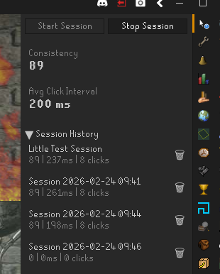

AFK Stats Tracker

This RuneLite plugin tracks mouse clicks during AFK sessions in Old School RuneScape.

Tracked Stats:
- Consistency: A score from 0 to 100 showing how regular your click timing is. Higher scores mean more consistent intervals.
- Average Click Interval: The average time in milliseconds between clicks.

Purpose: To track afk metrics to compare between activies and methods. Similar to tracking DPS and Kills/hr.

## Wiki Guide

See the [AFK Activity Tracker Guide](https://oldschool.runescape.wiki/w/Guide:AFK_Activity_Tracker) on the Old School RuneScape Wiki for a detailed breakdown of the tracked metrics, interactive scatter plots comparing activities, and aggregated averages across activity groups like Bankstanding, Fishing, and Salvaging.
